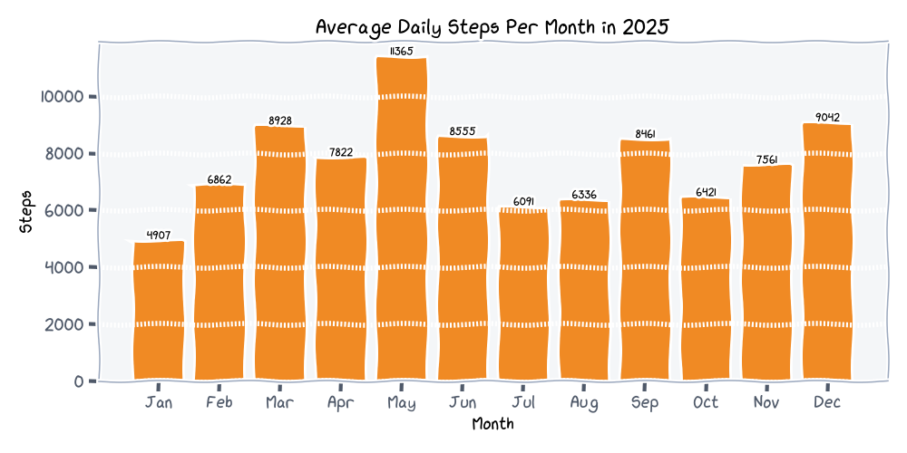
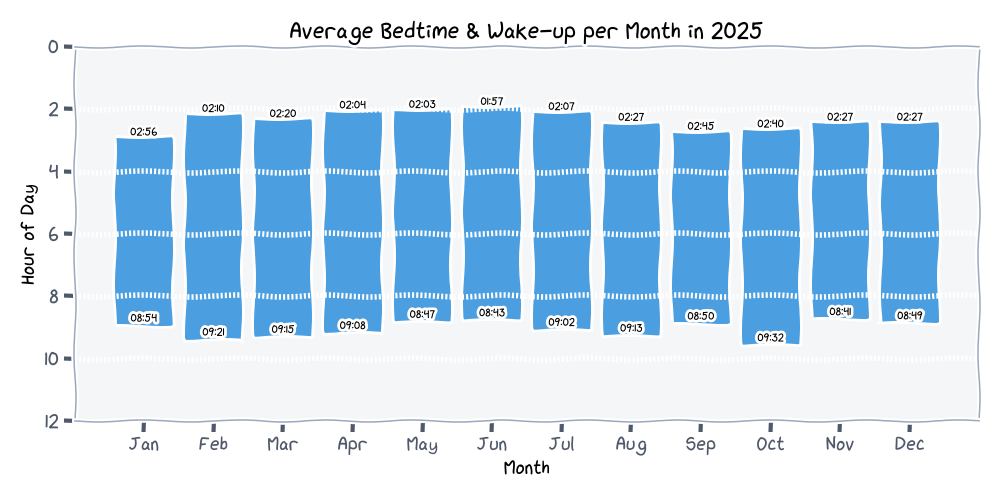
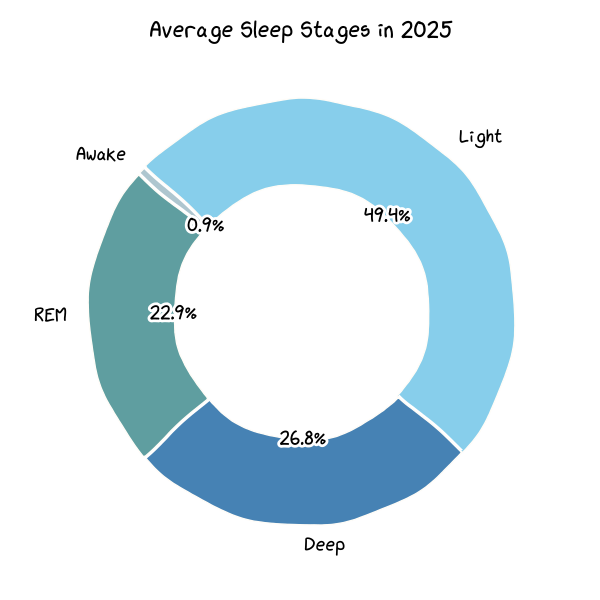

# Mi Fitness Data Viz CLI

A lightweight Python-based command-line tool that turns Xiaomi Mi Fitness exports into yearly stories about your activity, sleep, heart rate, and vitality, with every chart using Matplotlib's xkcd mode.

## Highlights

- Sleep timelines: bedtime and wake-up bands split by month and by weekday, plus duration and stage distributions.
- Steps breakdowns: month-over-month averages, weekday behavior, a yearly histogram, and a 24-hour density profile.
- Heart rate snapshots: average BPM per month, weekday, and hour keeps resting rhythms visible.
- Vitality scores: histogram and monthly averages show how Xiaomi's vitality metric evolves through the year.
- Text summaries: the terminal reports top days, averages, and basic stats alongside the plots.

## Example visualizations

<div align="center">







</div>

## Installation

### Requirements

```bash
python -m pip install pandas matplotlib
```

### Font setup (optional)

Install the [xkcd font](https://github.com/ipython/xkcd-font) or point `--font` at any font you already have installed if you want a different look.

## Usage

### 1. Export your data

1. Visit <https://account.xiaomi.com/fe/service/account/privacy>.
2. Request a Mi Fitness export.
3. When the archive arrives, unzip it and locate `hlth_center_fitness_data.csv`.

> **Why not `hlth_center_aggregated_fitness_data.csv`?**
> 
> Aggregated files often lose some records. Directly operating on `hlth_center_fitness_data.csv` keeps the original data intact, ensuring chart accuracy. To analyze using aggregated files, run `python main_agg.py hlth_center_aggregated_fitness_data.csv`, whose command-line arguments correspond to `main.py`. However, note that distorted statistical results may appear when source exported data is incomplete.

### 2. Generate visualizations

```bash
# Basic run with defaults
python main.py hlth_center_fitness_data.csv

# Pick a different year and timezone
python main.py data.csv --year 2025 --tz -5

# Send output elsewhere and change formats/fonts
python main.py data.csv --output plots --format jpg --font "Comic Neue"
```

## CLI arguments

| Flag | Description |
| --- | --- |
| `input_csv` | Positional path to `hlth_center_fitness_data.csv`. |
| `--year` | Year to analyze. |
| `--tz` | Timezone offset in hours before statistics are computed (default `8`). |
| `--output` | Directory for exported charts (default `output`). |
| `--format` | File format for plots (`png`, `jpg`, or `svg`; default `png`). |
| `--font` | Matplotlib font family for the themed axes (default `xkcd Script`). |

## Data privacy

Everything runs locally. The script reads the CSV you supply, computes statistics in-memory, and writes figures to disk. Nothing is uploaded or shared.

## Acknowledgments

Special thanks to the [mi-fitness-yearly-visual](https://github.com/luoingly/mi-fitness-yearly-visual) project, as some parts of this tool were inspired by its implementation.
